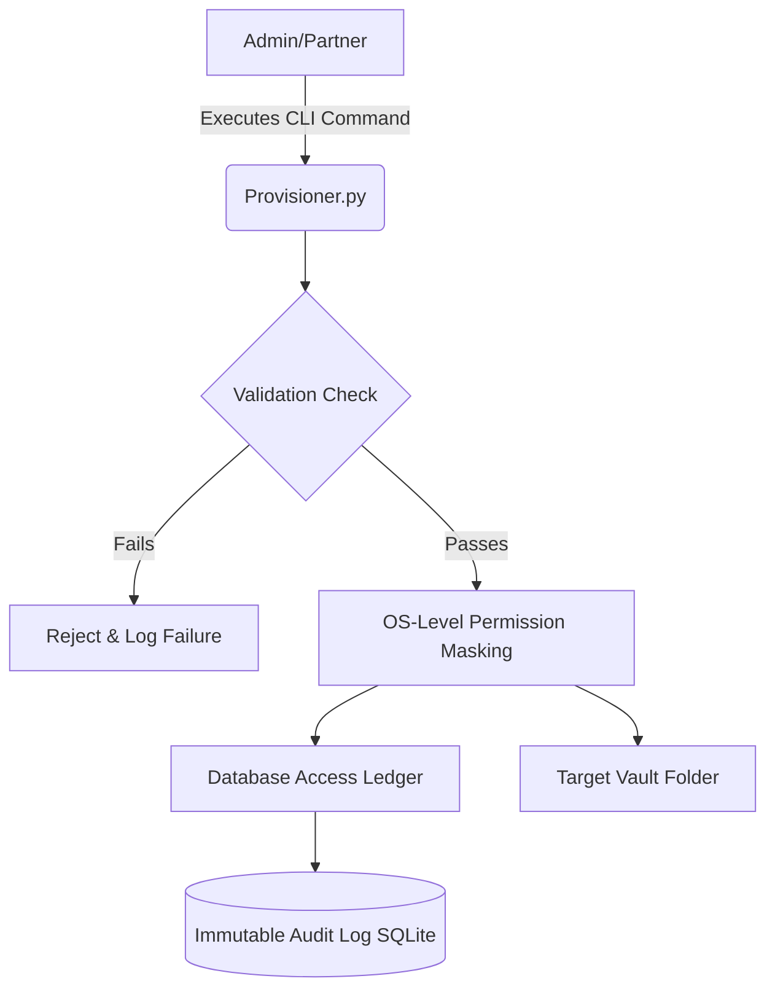

# Corporate Legal IAM System: Automated Access & Compliance Provisioning

An automated Identity and Access Management (IAM) engine built to handle high-turnover matter onboarding and offboarding within law firms. 

Law firms handle highly sensitive M&A and litigation data. This tool eliminates IT ticketing bottlenecks by programmatically enforcing strict **"least-privilege" (Zero-Trust)** access models on case files. Crucially, it generates the immutable, tamper-evident audit logs required for corporate governance and regulatory compliance.

## System Architecture



## Core Features

* **Deterministic Permission Controls**: Grants and revokes system-level folder access programmatically using POSIX-compliant permission masking.
* **Relational Integrity Validation**: Verifies employee verification status against existing firm identity stores prior to execution.
* **Atomic Database Transactions**: Ensures that OS-level permission changes and database audit logs are committed simultaneously, preventing state mismatch.
* **Immutable Audit Logging**: Captures chronological records of actions, operators, targets, and system outcomes to guarantee strict compliance tracking.

## Tech Stack

* **Language:** Python 3
* **Interface:** Command Line Interface (CLI) using `click`
* **Database:** SQLite3 (Local, serverless logging)
* **System Integration:** Native OS `stat` and `os` modules for direct file system manipulation

---

## Installation & Setup

1. Clone the repository:
```bash
git clone [https://github.com/YOUR_USERNAME/legaltech-access-provisioner.git](https://github.com/YOUR_USERNAME/legaltech-access-provisioner.git)
cd legaltech-access-provisioner

```


2. Install the required CLI dependencies:
```bash
pip install -r requirements.txt

```


3. Initialize the database and create the mock secure storage vault:
```bash
python database.py

```


---

## Usage & Execution Workflow

### 1. Provision New Access

To grant write access to an associate for a sensitive M&A folder:

```bash
python provisioner.py grant --operator partner1@firm.com --user associate1@firm.com --matter CASE101 --level WRITE

```

### 2. Revoke Access (Immediate Deprovisioning)

To immediately cut access to a project upon case closing, lateral departures, or ethical wall enforcement:

```bash
python provisioner.py revoke --operator partner1@firm.com --user associate1@firm.com --matter CASE101

```

### 3. Review the Compliance Ledger

To display a strict history of database and system-level operations for a compliance auditor:

```bash
python provisioner.py logs

```

```

***

